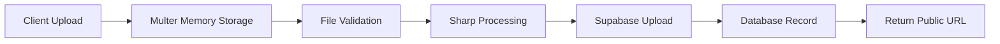

## Overview

JOIP Web Application uses [Supabase Storage](https://supabase.com/storage) for all file uploads, including user media, session thumbnails, community content, and manual session images. This guide covers complete setup, bucket configuration, access policies, and troubleshooting.

## Why Supabase Storage?

Supabase Storage is the primary file storage solution for JOIP because:

- **CDN Distribution**: Global content delivery network for fast access
- **Automatic Scaling**: No file count or bucket limits
- **S3-Compatible API**: Standard object storage interface
- **Built-in Image Optimization**: Automatic resizing and transformations
- **Public/Private Buckets**: Flexible access control
- **Generous Free Tier**: 1 GB storage, 2 GB bandwidth per month
- **Direct Integration**: Works seamlessly with JOIP's architecture

## Prerequisites

- Supabase account (free or paid)
- Basic understanding of object storage concepts
- Access to Replit Secrets or environment variables

## Supabase Project Setup

<Steps>
  <Step title="Create Supabase Account">
    1. Visit [supabase.com](https://supabase.com)
    2. Click "Start your project"
    3. Sign up with GitHub/Google/email
    4. Verify your email address
  </Step>

  <Step title="Create New Project">
    1. Click "New Project" in Supabase dashboard
    2. Configure your project:
       - **Organization**: Select or create organization
       - **Project Name**: `joip-production` (or your preferred name)
       - **Database Password**: Generate strong password (save this!)
       - **Region**: Choose closest to your users (e.g., US East)
       - **Pricing Plan**: Free (upgrade later as needed)
    3. Click "Create new project"
    4. Wait 2-3 minutes for provisioning
  </Step>

  <Step title="Retrieve API Credentials">
    After project creation:

    1. Navigate to **Settings** → **API**
    2. Copy the following values:
       - **Project URL**: `https://xyzabcdefg123456.supabase.co`
       - **anon public key**: `eyJhbGciOiJIUzI1NiIsInR5cCI6IkpXVCJ9...`
       - **service_role secret key**: `eyJhbGciOiJIUzI1NiIsInR5cCI6IkpXVCJ9...`

    <Warning>
      **Keep service_role key secret!** It has full access to your project. Never expose in client code.
    </Warning>
  </Step>

  <Step title="Configure Environment Variables">
    Add credentials to Replit Secrets:

    ```bash
    SUPABASE_URL="https://xyzabcdefg123456.supabase.co"
    SUPABASE_ANON_KEY="eyJhbGciOiJIUzI1NiIsInR5cCI6IkpXVCJ9..."
    SUPABASE_SERVICE_KEY="eyJhbGciOiJIUzI1NiIsInR5cCI6IkpXVCJ9..."
    ```
  </Step>
</Steps>

## Storage Bucket Configuration

JOIP uses two primary storage buckets:

### 1. user-media Bucket

**Purpose**: Stores user-specific uploads
- Manual session images
- Media vault files
- Session thumbnails

**Structure:**
```
user-media/
├── users/{userId}/
│   ├── manual-sessions/{sessionId}/
│   │   ├── image1.jpg
│   │   ├── image2.png
│   │   └── ...
│   ├── media-vault/
│   │   ├── photo1.jpg
│   │   └── video1.mp4
│   └── thumbnails/
│       └── session-123.jpg
```

### 2. general Bucket

**Purpose**: Stores community-shared content
- Community session snapshots
- Shared media copies
- Public resources

**Structure:**
```
general/
├── community/
│   ├── sessions/{snapshotId}/
│   │   └── media files
│   └── media/
│       └── shared files
```

### Create Buckets

<Steps>
  <Step title="Access Storage Dashboard">
    1. Open your Supabase project
    2. Navigate to **Storage** in left sidebar
    3. Click "Create a new bucket"
  </Step>

  <Step title="Create user-media Bucket">
    Configure the first bucket:

    - **Name**: `user-media`
    - **Public bucket**: ✓ Enabled (for CDN access)
    - **File size limit**: 100 MB (or your preference)
    - **Allowed MIME types**: Leave empty (all types allowed)

    Click "Create bucket"
  </Step>

  <Step title="Create general Bucket">
    Repeat for second bucket:

    - **Name**: `general`
    - **Public bucket**: ✓ Enabled
    - **File size limit**: 100 MB
    - **Allowed MIME types**: Leave empty

    Click "Create bucket"
  </Step>
</Steps>

<Note>
  JOIP automatically creates these buckets on first startup if they don't exist (`server/supabase.ts`). Manual creation is recommended for production.
</Note>

## Storage Policies

Supabase uses Row Level Security (RLS) policies for access control. For public buckets, configure policies:

### user-media Bucket Policies

<CodeGroup>
```sql Allow Public Reads
-- Allow anyone to read files (required for CDN)
CREATE POLICY "Public read access"
ON storage.objects FOR SELECT
USING (bucket_id = 'user-media');
```

```sql Allow Authenticated Uploads
-- Allow authenticated users to upload to their own folder
CREATE POLICY "User upload access"
ON storage.objects FOR INSERT
WITH CHECK (
  bucket_id = 'user-media' AND
  auth.uid()::text = (storage.foldername(name))[1]
);
```

```sql Allow User Deletes
-- Allow users to delete their own files
CREATE POLICY "User delete access"
ON storage.objects FOR DELETE
USING (
  bucket_id = 'user-media' AND
  auth.uid()::text = (storage.foldername(name))[1]
);
```
</CodeGroup>

### general Bucket Policies

```sql
-- Public read access for community content
CREATE POLICY "Public read access"
ON storage.objects FOR SELECT
USING (bucket_id = 'general');

-- Server-only writes (uses service_role key)
-- No INSERT policy needed for general users
```

<Note>
  JOIP uses the **service_role** key for server-side storage operations, which bypasses RLS policies. Client policies are for direct Supabase client usage (not currently used in JOIP).
</Note>

## File Upload Implementation

JOIP implements file uploads using in-memory buffers with Multer and Sharp for image processing.

### Upload Flow



### Server-Side Upload (`server/upload.ts`)

```typescript
import multer from 'multer';
import { supabaseClient } from './supabase';

// In-memory storage (no local filesystem)
const storage = multer.memoryStorage();

const upload = multer({
  storage,
  limits: {
    fileSize: 100 * 1024 * 1024, // 100 MB
  },
  fileFilter: (req, file, cb) => {
    // Validate MIME type
    const allowedTypes = [
      'image/jpeg',
      'image/png',
      'image/webp',
      'image/gif',
      'video/mp4',
      'video/webm'
    ];

    if (allowedTypes.includes(file.mimetype)) {
      cb(null, true);
    } else {
      cb(new Error('Invalid file type'));
    }
  },
});
```

### Upload to Supabase (`server/supabase.ts`)

```typescript
export async function uploadFile(
  bucket: string,
  path: string,
  file: Buffer,
  contentType: string
): Promise<string> {
  const { data, error } = await supabaseClient.storage
    .from(bucket)
    .upload(path, file, {
      contentType,
      upsert: false, // Prevent overwriting
    });

  if (error) throw error;

  // Get public URL
  const { data: publicUrl } = supabaseClient.storage
    .from(bucket)
    .getPublicUrl(path);

  return publicUrl.publicUrl;
}
```

## File Management Operations

### Upload File

```typescript
// Manual session image upload
const fileBuffer = req.file.buffer;
const userId = getUserId(req);
const sessionId = 123;
const filename = 'image1.jpg';

const path = `users/${userId}/manual-sessions/${sessionId}/${filename}`;
const publicUrl = await uploadFile(
  'user-media',
  path,
  fileBuffer,
  'image/jpeg'
);

// Store in database
await db.insert(sessionMedia).values({
  sessionId,
  mediaUrl: publicUrl,
  type: 'image',
});
```

### Delete File

```typescript
// Extract path from public URL
const storagePath = extractFilePathFromUrl(publicUrl);

// Delete from Supabase
const { error } = await supabaseClient.storage
  .from('user-media')
  .remove([storagePath]);

if (error) throw error;

// Delete database record
await db.delete(sessionMedia)
  .where(eq(sessionMedia.mediaUrl, publicUrl));
```

### Delete Folder (Session Cleanup)

```typescript
// When deleting manual session, remove entire folder
const userId = getUserId(req);
const sessionId = 123;
const folderPath = `users/${userId}/manual-sessions/${sessionId}`;

// List all files in folder
const { data: files, error: listError } = await supabaseClient.storage
  .from('user-media')
  .list(folderPath);

if (files?.length) {
  const filePaths = files.map(f => `${folderPath}/${f.name}`);

  // Batch delete
  const { error: deleteError } = await supabaseClient.storage
    .from('user-media')
    .remove(filePaths);
}
```

### Copy File Between Buckets

```typescript
// Copy user media to community (for sharing)
async function copyToGeneral(
  sourcePath: string,
  destinationPath: string
): Promise<string> {
  // Download from user-media
  const { data: fileData, error: downloadError } =
    await supabaseClient.storage
      .from('user-media')
      .download(sourcePath);

  if (downloadError) throw downloadError;

  // Upload to general bucket
  const buffer = await fileData.arrayBuffer();
  const { error: uploadError } = await supabaseClient.storage
    .from('general')
    .upload(destinationPath, buffer, {
      contentType: fileData.type,
    });

  if (uploadError) throw uploadError;

  // Return new public URL
  const { data: publicUrl } = supabaseClient.storage
    .from('general')
    .getPublicUrl(destinationPath);

  return publicUrl.publicUrl;
}
```

## Storage Diagnostics

JOIP provides a storage status endpoint for troubleshooting:

### Check Storage Health

```bash
GET /api/storage/status
```

**Response:**
```json
{
  "configured": true,
  "accessible": true,
  "buckets": {
    "user-media": true,
    "general": true
  },
  "upload_test": "success",
  "message": "Storage is fully operational"
}
```

**Error Response (Paused Project):**
```json
{
  "configured": true,
  "accessible": false,
  "error": "STORAGE_UNREACHABLE",
  "message": "Cannot connect to Supabase Storage. Project may be paused."
}
```

### Common Status Codes

- `STORAGE_CONFIG_ERROR`: Missing environment variables
- `STORAGE_UNREACHABLE`: Cannot connect to Supabase
- `STORAGE_PREFLIGHT_FAILED`: Bucket creation/access failed
- `UPLOAD_FAILED`: Test upload failed

## Image Optimization

Supabase Storage supports automatic image transformations via URL parameters:

### Resize Image

```
https://xyz.supabase.co/storage/v1/object/public/user-media/image.jpg?width=800&height=600
```

### Quality Adjustment

```
https://xyz.supabase.co/storage/v1/object/public/user-media/image.jpg?quality=80
```

### Format Conversion

```
https://xyz.supabase.co/storage/v1/object/public/user-media/image.jpg?format=webp
```

### Combined Transformations

```
https://xyz.supabase.co/storage/v1/object/public/user-media/image.jpg?width=400&quality=75&format=webp
```

<Note>
  Image transformations are cached at the CDN edge for optimal performance.
</Note>

## Monitoring and Limits

### Storage Usage

Monitor storage usage in Supabase dashboard:

1. Open your project
2. Navigate to **Settings** → **Usage**
3. View:
   - Total storage used
   - Bandwidth consumed
   - API requests count
   - Active connections

### Free Tier Limits

- **Storage**: 1 GB
- **Bandwidth**: 2 GB/month
- **API requests**: Unlimited (rate-limited)
- **File size**: 50 MB (configurable up to 5 GB on paid plans)

<Warning>
  **Exceeding Limits:** Projects exceeding free tier limits may be throttled or paused. Upgrade to paid plan for higher limits.
</Warning>

### Paid Plan Upgrades

Supabase Pro plan ($25/month) includes:
- 100 GB storage
- 200 GB bandwidth
- No pausing due to inactivity
- Priority support
- Increased file size limits (5 GB)

## Troubleshooting

### Storage Unreachable (503 Errors)

**Symptom:** Manual session uploads fail with `STORAGE_UNREACHABLE`

**Cause:** Supabase project is paused (free tier inactivity)

**Solution:**
1. Log in to Supabase dashboard
2. Navigate to your project
3. Click "Resume Project" (green button)
4. Wait 1-2 minutes for project to wake up
5. Test with `GET /api/storage/status`

### Missing Buckets

**Symptom:** Upload fails with "Bucket not found" error

**Solution:**
1. Check bucket names: `user-media` and `general` (case-sensitive)
2. Manually create buckets in Supabase dashboard
3. Restart JOIP application to auto-create
4. Verify bucket creation with storage status endpoint

### CORS Errors

**Symptom:** Browser console shows CORS policy errors

**Solution:**
1. Ensure buckets are marked as "Public"
2. Add allowed origins in Supabase **Authentication** → **URL Configuration**:
   ```
   https://app.joip.io
   https://your-repl.replit.app
   ```
3. Clear browser cache and retry

### File Size Limit Errors

**Symptom:** Upload fails with "File too large" error

**Solution:**
1. Check client-side validation (100 MB default)
2. Adjust Multer limit in `server/upload.ts`:
   ```typescript
   limits: { fileSize: 200 * 1024 * 1024 } // 200 MB
   ```
3. Update Supabase bucket settings (dashboard)
4. Consider compressing images before upload

### Invalid File Type

**Symptom:** Upload rejected with "Invalid file type" error

**Solution:**
1. Check allowed MIME types in `server/upload.ts`
2. Add additional types if needed:
   ```typescript
   const allowedTypes = [
     'image/jpeg',
     'image/png',
     'image/webp',
     'image/gif',
     'image/svg+xml', // Add SVG support
   ];
   ```
3. Restart application

### Slow Upload Performance

**Symptom:** Uploads take unusually long time

**Solutions:**
1. **Check Supabase Region**: Use region closest to users
2. **Enable Image Compression**: Use Sharp to compress before upload:
   ```typescript
   import sharp from 'sharp';

   const compressed = await sharp(buffer)
     .resize(2000, 2000, { fit: 'inside', withoutEnlargement: true })
     .jpeg({ quality: 85 })
     .toBuffer();
   ```
3. **Upgrade Supabase Plan**: Pro plan offers better performance
4. **Monitor Network**: Check for ISP throttling or network issues

### Orphaned Files

**Symptom:** Files remain in storage after deleting database records

**Prevention:**
- Always delete storage files before database records
- Use database transactions to ensure atomicity
- Implement cleanup jobs for orphaned files

**Cleanup Script:**
```typescript
// Find orphaned files by comparing storage to database
const { data: storageFiles } = await supabaseClient.storage
  .from('user-media')
  .list('users');

const dbUrls = await db.select({ url: sessionMedia.mediaUrl })
  .from(sessionMedia);

const orphaned = storageFiles.filter(
  file => !dbUrls.some(db => db.url.includes(file.name))
);

// Delete orphaned files
if (orphaned.length) {
  const paths = orphaned.map(f => f.name);
  await supabaseClient.storage.from('user-media').remove(paths);
}
```

## Security Best Practices

<Warning>
  **Storage Security Checklist:**
  - ✓ Never expose `SUPABASE_SERVICE_KEY` in client code
  - ✓ Validate file types and sizes server-side
  - ✓ Sanitize filenames to prevent path traversal
  - ✓ Use user-specific folders for isolation
  - ✓ Implement rate limiting on upload endpoints
  - ✓ Regularly audit storage usage
  - ✓ Enable Supabase project billing alerts
  - ✓ Rotate API keys periodically
</Warning>

### Filename Sanitization

```typescript
import path from 'path';

function sanitizeFilename(filename: string): string {
  // Remove path traversal sequences
  const sanitized = filename.replace(/\.\.[\/\\]/g, '');

  // Remove special characters
  return sanitized.replace(/[^a-zA-Z0-9._-]/g, '_');
}

// Usage
const safe = sanitizeFilename(req.file.originalname);
const storagePath = `users/${userId}/media/${safe}`;
```

### Path Validation

```typescript
// server/routes.ts (media sharing endpoint)
function isValidStoragePath(path: string, userId: string): boolean {
  // Must start with users/{userId}/
  const pattern = new RegExp(`^users/${userId}/[a-zA-Z0-9/_-]+$`);
  return pattern.test(path);
}

// Reject invalid paths
if (!isValidStoragePath(storagePath, getUserId(req))) {
  return res.status(400).json({ error: 'Invalid storage path' });
}
```

## Performance Optimization

### CDN Caching

Supabase Storage uses Cloudflare CDN with automatic caching:

- **Static Assets**: Cached for 1 year
- **Dynamic Content**: Respect `Cache-Control` headers
- **Purging**: Automatic on file update/delete

### Lazy Loading

Implement lazy loading for images:

```jsx
import { useState, useEffect } from 'react';

function LazyImage({ src, alt }) {
  const [loaded, setLoaded] = useState(false);

  return (
     setLoaded(true)}
      className={loaded ? 'opacity-100' : 'opacity-0'}
    />
  );
}
```

### Batch Operations

Batch uploads and deletes for better performance:

```typescript
// Upload multiple files
const uploads = files.map(async (file) => {
  const path = `users/${userId}/media/${file.name}`;
  return uploadFile('user-media', path, file.buffer, file.mimetype);
});

const urls = await Promise.all(uploads);

// Batch delete
const paths = urls.map(url => extractFilePathFromUrl(url));
await supabaseClient.storage.from('user-media').remove(paths);
```

## Next Steps

<CardGroup cols={2}>
  <Card title="Deploy on Replit" icon="rocket" href="/guides/deployment/replit">
    Deploy your configured storage to Replit
  </Card>
  <Card title="Environment Variables" icon="gear" href="/guides/deployment/environment-variables">
    Complete environment variable reference
  </Card>
  <Card title="Database Setup" icon="database" href="/guides/deployment/database-setup">
    Configure PostgreSQL database
  </Card>
</CardGroup>
