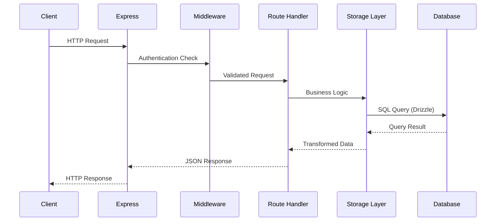
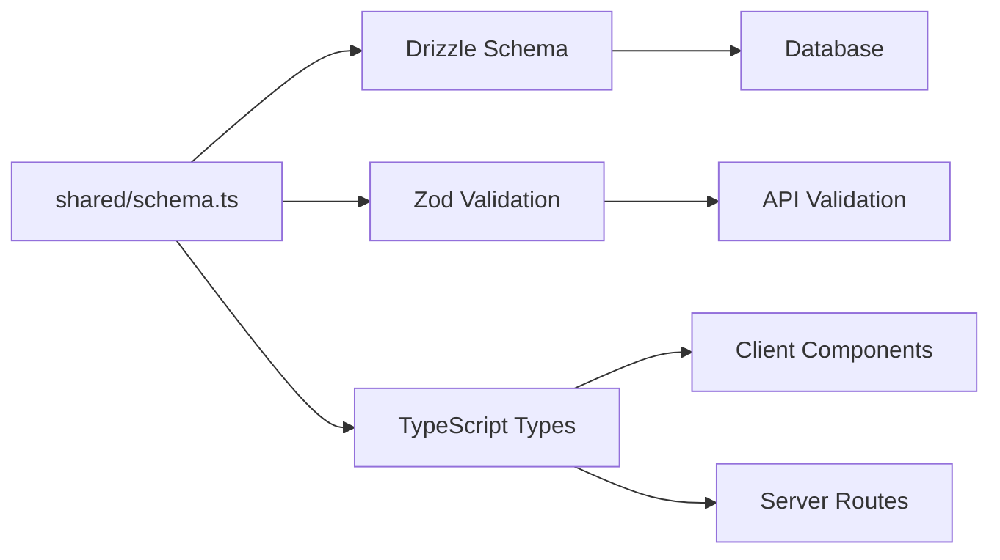

## Monorepo Overview

The JOIP Web Application follows a **monorepo architecture** with three main directories:

```
Joip-Web-App-2/
├── client/          # React frontend application
├── server/          # Express.js backend API
├── shared/          # Shared TypeScript types and schemas
├── docs/            # Documentation (Mintlify)
├── scripts/         # Build and utility scripts
├── public/          # Static assets
└── package.json     # Root package.json for entire monorepo
```

<Note>
  This is a **single-package monorepo** - all code shares the same `node_modules` and `package.json`. There are no separate packages or workspaces.
</Note>

## Client Directory Structure

The `client/` directory contains the React frontend application built with Vite:

```
client/
├── src/
│   ├── components/      # Reusable React components
│   │   ├── ui/          # Radix UI primitives (Button, Dialog, etc.)
│   │   ├── sessions/    # Session-related components
│   │   ├── NavItems.tsx # Navigation menu items
│   │   └── ...
│   ├── pages/           # Route-level page components
│   │   ├── SessionsPage.tsx
│   │   ├── EditSessionPage.tsx
│   │   ├── SessionPlayerPage.tsx
│   │   ├── ManualSessionCreationPage.tsx
│   │   ├── ManualSessionEditPage.tsx
│   │   ├── SmartCaptionsPage.tsx
│   │   ├── BabecockStudioPage.tsx
│   │   ├── MediaVaultPage.tsx
│   │   ├── CommunityPage.tsx
│   │   ├── AdminPanelPage.tsx
│   │   └── ...
│   ├── gaslighter/      # Gaslighter feature module
│   │   ├── components/  # Gaslighter-specific components
│   │   ├── GaslighterPage.tsx
│   │   └── utils.ts
│   ├── scroller/        # Scroller feature module
│   │   ├── components/  # Scroller-specific components
│   │   ├── ScrollerPage.tsx
│   │   └── utils.ts
│   ├── hooks/           # Custom React hooks
│   │   ├── use-toast.ts
│   │   └── ...
│   ├── lib/             # Utility libraries
│   │   ├── AuthContext.tsx   # Authentication context
│   │   ├── utils.ts          # Utility functions
│   │   └── queryClient.ts    # React Query setup
│   ├── styles/          # Global styles
│   ├── assets/          # Images, icons, fonts
│   ├── App.tsx          # Main application component with routing
│   ├── main.tsx         # Application entry point
│   └── index.css        # Global CSS and Tailwind imports
├── index.html           # HTML entry point
└── vite.config.ts       # Vite configuration
```

### Key Client Files

#### `App.tsx` - Application Routes

Defines all application routes using Wouter:

<CodeGroup>
```tsx client/src/App.tsx
import { Route, Switch } from "wouter";
import { AuthWrapper } from "./lib/AuthWrapper";
import SessionsPage from "./pages/SessionsPage";
import EditSessionPage from "./pages/EditSessionPage";
import SessionPlayerPage from "./pages/SessionPlayerPage";
// ... more imports

function App() {
  return (
    <Switch>
      <Route path="/" component={LandingPage} />
      <Route path="/login" component={LoginPage} />
      
      {/* Protected routes with AuthWrapper */}
      <Route path="/sessions">
        <AuthWrapper><SessionsPage /></AuthWrapper>
      </Route>
      
      <Route path="/sessions/:id/play">
        <AuthWrapper><SessionPlayerPage /></AuthWrapper>
      </Route>
      
      {/* ... more routes */}
    </Switch>
  );
}
```
</CodeGroup>

#### `lib/AuthContext.tsx` - Authentication State

Manages user authentication state across the application:

<CodeGroup>
```tsx client/src/lib/AuthContext.tsx
import { createContext, useContext, useState, useEffect } from "react";

interface AuthContextType {
  user: User | null;
  isLoading: boolean;
  login: (email: string, password: string) => Promise<void>;
  logout: () => Promise<void>;
}

export const AuthContext = createContext<AuthContextType | undefined>(undefined);

export function AuthProvider({ children }: { children: React.ReactNode }) {
  const [user, setUser] = useState<User | null>(null);
  const [isLoading, setIsLoading] = useState(true);

  // Fetch current user on mount
  useEffect(() => {
    fetch('/api/auth/user')
      .then(res => res.json())
      .then(data => setUser(data.user))
      .finally(() => setIsLoading(false));
  }, []);

  // ... login and logout implementations

  return (
    <AuthContext.Provider value={{ user, isLoading, login, logout }}>
      {children}
    </AuthContext.Provider>
  );
}
```
</CodeGroup>

### Feature Module Pattern

Some features like **Gaslighter** and **Scroller** are organized as self-contained modules:

```
gaslighter/
├── components/
│   ├── GaslighterGrid.tsx
│   ├── GaslighterSettings.tsx
│   └── MediaModal.tsx
├── GaslighterPage.tsx     # Main page component
├── utils.ts               # Feature-specific utilities
└── types.ts               # Feature-specific types
```

<Note>
  Feature modules contain all components and logic specific to that feature, but still use shared UI components from `components/ui/` and utilities from `lib/`.
</Note>

## Server Directory Structure

The `server/` directory contains the Express.js backend API:

```
server/
├── index.ts                 # Server entry point and Express setup
├── routes.ts                # API route definitions
├── db.ts                    # Database connection and pool config
├── storage.ts               # Database CRUD operations (IStorage)
├── vite.ts                  # Vite middleware for development
├── auth.ts                  # Authentication strategies
├── authUtils.ts             # Auth helper functions
├── environmentConfig.ts     # Environment variable validation
├── openai.ts                # AI caption generation
├── babecock.ts              # Image combination algorithms
├── imageAnalysis.ts         # Server-side image processing
├── imageCompression.ts      # Image optimization
├── usageTracking.ts         # Analytics and usage monitoring
├── supabase.ts              # Supabase storage client
├── upload.ts                # File upload handling (Multer)
├── errorResponse.ts         # Error response utilities
├── creditService.ts         # Credit system management
├── creditMiddleware.ts      # Credit validation middleware
└── promptThemes.ts          # AI caption theme definitions
```

### Key Server Files

#### `index.ts` - Server Entry Point

Initializes Express, middleware, and routes:

<CodeGroup>
```typescript server/index.ts
import express from "express";
import session from "express-session";
import { setupReplitAuth, setupLocalAuth } from "./auth";
import { router as apiRoutes } from "./routes";
import { db } from "./db";
import { logger } from "./logger";

const app = express();
const PORT = 5000;

// Middleware
app.use(express.json({ limit: '100mb' }));
app.use(express.urlencoded({ extended: true, limit: '100mb' }));

// Session configuration
app.use(session({
  secret: process.env.SESSION_SECRET!,
  resave: false,
  saveUninitialized: false,
  store: new PostgresSessionStore({ pool: db.pool }),
  cookie: { maxAge: 30 * 24 * 60 * 60 * 1000 } // 30 days
}));

// Authentication setup (Replit OIDC or local)
if (process.env.REPLIT_DOMAINS) {
  setupReplitAuth(app);
} else {
  setupLocalAuth(app);
}

// API routes
app.use('/api', apiRoutes);

// Development: Vite middleware
if (process.env.NODE_ENV === 'development') {
  const { setupViteMiddleware } = await import('./vite');
  await setupViteMiddleware(app);
}

// Production: Serve static files
else {
  app.use(express.static('dist/public'));
}

app.listen(PORT, () => {
  logger.info(`Server running on http://localhost:${PORT}`);
});
```
</CodeGroup>

#### `routes.ts` - API Route Definitions

Defines all REST API endpoints:

<CodeGroup>
```typescript server/routes.ts
import { Router } from "express";
import { storage } from "./storage";
import { isAuthenticated } from "./authUtils";
import { z } from "zod";
import { insertSessionSchema } from "@shared/schema";

export const router = Router();

// Session Management
router.get('/sessions', isAuthenticated, async (req, res) => {
  const userId = req.user!.id;
  const sessions = await storage.getUserSessions(userId);
  res.json(sessions);
});

router.post('/sessions', isAuthenticated, async (req, res) => {
  const userId = req.user!.id;
  const validated = insertSessionSchema.parse(req.body);
  const session = await storage.createSession({ ...validated, userId });
  res.json(session);
});

router.get('/sessions/:id', isAuthenticated, async (req, res) => {
  const sessionId = parseInt(req.params.id);
  const session = await storage.getSession(sessionId);
  
  if (!session) {
    return res.status(404).json({ error: 'Session not found' });
  }
  
  // Verify ownership or public access
  if (session.userId !== req.user!.id && !session.isPublic) {
    return res.status(403).json({ error: 'Forbidden' });
  }
  
  res.json(session);
});

// ... more routes
```
</CodeGroup>

#### `storage.ts` - Database Abstraction Layer

Implements the `IStorage` interface for all database operations:

<CodeGroup>
```typescript server/storage.ts
import { db } from "./db";
import * as schema from "@shared/schema";
import { eq, and, desc } from "drizzle-orm";

interface IStorage {
  // Session CRUD
  createSession(data: InsertSession): Promise<Session>;
  updateSession(id: number, data: UpdateSession): Promise<Session>;
  deleteSession(id: number): Promise<void>;
  getSession(id: number): Promise<Session | null>;
  getUserSessions(userId: string): Promise<Session[]>;
  
  // Media Management
  addSessionMedia(data: InsertSessionMedia[]): Promise<void>;
  clearSessionMedia(sessionId: number): Promise<void>;
  getSessionMedia(sessionId: number): Promise<SessionMedia[]>;
  
  // Sharing
  shareSession(sessionId: number, userId?: string): Promise<SharedSession>;
  getSessionByShareCode(shareCode: string): Promise<Session | null>;
}

class DatabaseStorage implements IStorage {
  async createSession(data: InsertSession): Promise<Session> {
    const [session] = await db.insert(schema.contentSessions)
      .values(data)
      .returning();
    return session;
  }
  
  async getSession(id: number): Promise<Session | null> {
    const [session] = await db.select()
      .from(schema.contentSessions)
      .where(eq(schema.contentSessions.id, id));
    return session || null;
  }
  
  // ... more implementations
}

export const storage = new DatabaseStorage();
```
</CodeGroup>

## Shared Directory Structure

The `shared/` directory contains code used by both client and server:

```
shared/
├── schema.ts            # Drizzle ORM schema and Zod validation
└── types.ts             # Shared TypeScript types
```

### `schema.ts` - Central Schema Definition

Defines database schema using Drizzle ORM and Zod validation schemas:

<CodeGroup>
```typescript shared/schema.ts
import { pgTable, serial, text, varchar, timestamp, boolean, integer } from "drizzle-orm/pg-core";
import { createInsertSchema } from "drizzle-zod";
import { z } from "zod";

// Database table definitions
export const users = pgTable("users", {
  id: varchar("id").primaryKey().notNull(),
  email: varchar("email").unique(),
  password: varchar("password"),
  firstName: varchar("first_name"),
  lastName: varchar("last_name"),
  profileImageUrl: varchar("profile_image_url"),
  role: varchar("role").notNull().default("user"),
  isActive: boolean("is_active").notNull().default(true),
  createdAt: timestamp("created_at").defaultNow(),
  updatedAt: timestamp("updated_at").defaultNow(),
});

export const contentSessions = pgTable("content_sessions", {
  id: serial("id").primaryKey(),
  title: text("title").notNull(),
  userId: varchar("user_id").references(() => users.id),
  subreddits: text("subreddits").array().notNull(),
  intervalMin: integer("interval_min").default(3),
  intervalMax: integer("interval_max").default(10),
  transition: text("transition").default("fade"),
  thumbnail: text("thumbnail"),
  aiPrompt: text("ai_prompt"),
  captionTheme: text("caption_theme"),
  isPublic: boolean("is_public").default(false),
  isFavorite: boolean("is_favorite").default(false),
  isManualMode: boolean("is_manual_mode").default(false),
  isImported: boolean("is_imported").default(false),
  createdAt: timestamp("created_at").defaultNow(),
  updatedAt: timestamp("updated_at").defaultNow(),
});

export const sessionMedia = pgTable("session_media", {
  id: serial("id").primaryKey(),
  sessionId: integer("session_id").references(() => contentSessions.id, { onDelete: "cascade" }),
  mediaUrl: text("media_url").notNull(),
  thumbnail: text("thumbnail"),
  caption: text("caption"),
  type: text("type"),
  redditPostId: text("reddit_post_id"),
  subreddit: text("subreddit"),
  order: integer("order").notNull(),
});

// Zod validation schemas
export const insertSessionSchema = createInsertSchema(contentSessions, {
  title: z.string().min(1).max(200),
  subreddits: z.array(z.string()).min(1).max(10),
  intervalMin: z.number().min(1).max(30),
  intervalMax: z.number().min(1).max(60),
  transition: z.enum(["fade", "slide", "zoom", "flip", "none"]),
});

export const insertSessionMediaSchema = createInsertSchema(sessionMedia, {
  caption: z.string().max(500).optional(),
});

// TypeScript types
export type User = typeof users.$inferSelect;
export type InsertUser = typeof users.$inferInsert;
export type Session = typeof contentSessions.$inferSelect;
export type InsertSession = typeof contentSessions.$inferInsert;
export type SessionMedia = typeof sessionMedia.$inferSelect;
export type InsertSessionMedia = typeof sessionMedia.$inferInsert;
```
</CodeGroup>

<Note>
  **Single Source of Truth**: The `shared/schema.ts` file is the single source of truth for database schema, validation rules, and TypeScript types. Both client and server import from this file.
</Note>

## Import Aliases

The project uses TypeScript path aliases for cleaner imports:

```json tsconfig.json
{
  "compilerOptions": {
    "paths": {
      "@/*": ["./client/src/*"],
      "@shared/*": ["./shared/*"],
      "@assets/*": ["./client/src/assets/*"]
    }
  }
}
```

### Usage Examples

<CodeGroup>
```typescript Good - Using aliases
import { Button } from "@/components/ui/button";
import { insertSessionSchema } from "@shared/schema";
import logo from "@assets/logo.png";
```

```typescript Bad - Relative paths
import { Button } from "../../../components/ui/button";
import { insertSessionSchema } from "../../../../shared/schema";
import logo from "../../assets/logo.png";
```
</CodeGroup>

## Data Flow Architecture

### Request Flow



### Type Safety Flow



## Build Configuration

### Vite Configuration (`vite.config.ts`)

<CodeGroup>
```typescript vite.config.ts
import { defineConfig } from "vite";
import react from "@vitejs/plugin-react";
import path from "path";

export default defineConfig({
  plugins: [react()],
  resolve: {
    alias: {
      "@": path.resolve(__dirname, "./client/src"),
      "@shared": path.resolve(__dirname, "./shared"),
      "@assets": path.resolve(__dirname, "./client/src/assets"),
    },
  },
  server: {
    port: 5173,
    proxy: {
      "/api": {
        target: "http://localhost:5000",
        changeOrigin: true,
      },
    },
  },
  build: {
    outDir: "dist/public",
    emptyOutDir: true,
  },
});
```
</CodeGroup>

### Build Scripts (`package.json`)

<CodeGroup>
```json package.json
{
  "scripts": {
    "dev": "NODE_ENV=development tsx server/index.ts",
    "build": "node scripts/generate-logos.mjs && vite build && esbuild server/index.ts --platform=node --packages=external --bundle --format=esm --outdir=dist --minify",
    "start": "NODE_ENV=production node dist/index.js",
    "check": "tsc",
    "db:push": "drizzle-kit push"
  }
}
```
</CodeGroup>

## Styling Architecture

### Tailwind + Radix UI

The application uses **Tailwind CSS** for utility-first styling and **Radix UI** for accessible component primitives:

```
client/src/
├── components/ui/       # Radix UI wrapper components
│   ├── button.tsx       # Styled Button component
│   ├── dialog.tsx       # Modal dialog
│   ├── dropdown-menu.tsx
│   ├── toast.tsx
│   └── ...
├── index.css            # Global styles + Tailwind imports
└── styles/              # Additional style utilities
```

<CodeGroup>
```tsx components/ui/button.tsx
import * as React from "react";
import { Slot } from "@radix-ui/react-slot";
import { cva, type VariantProps } from "class-variance-authority";
import { cn } from "@/lib/utils";

const buttonVariants = cva(
  "inline-flex items-center justify-center rounded-md font-medium transition-colors",
  {
    variants: {
      variant: {
        default: "bg-primary text-primary-foreground hover:bg-primary/90",
        destructive: "bg-destructive text-destructive-foreground hover:bg-destructive/90",
        outline: "border border-input hover:bg-accent",
        ghost: "hover:bg-accent hover:text-accent-foreground",
      },
      size: {
        default: "h-10 px-4 py-2",
        sm: "h-9 px-3",
        lg: "h-11 px-8",
      },
    },
    defaultVariants: {
      variant: "default",
      size: "default",
    },
  }
);

export interface ButtonProps
  extends React.ButtonHTMLAttributes<HTMLButtonElement>,
    VariantProps<typeof buttonVariants> {
  asChild?: boolean;
}

const Button = React.forwardRef<HTMLButtonElement, ButtonProps>(
  ({ className, variant, size, asChild = false, ...props }, ref) => {
    const Comp = asChild ? Slot : "button";
    return (
      <Comp
        className={cn(buttonVariants({ variant, size, className }))}
        ref={ref}
        {...props}
      />
    );
  }
);

export { Button, buttonVariants };
```
</CodeGroup>

## Next Steps

Now that you understand the project structure:

- [Learn about Database Migrations](/guides/development/database-migrations)
- [Review Testing Guidelines](/guides/development/testing)
- [Explore the API Documentation](/api/introduction)