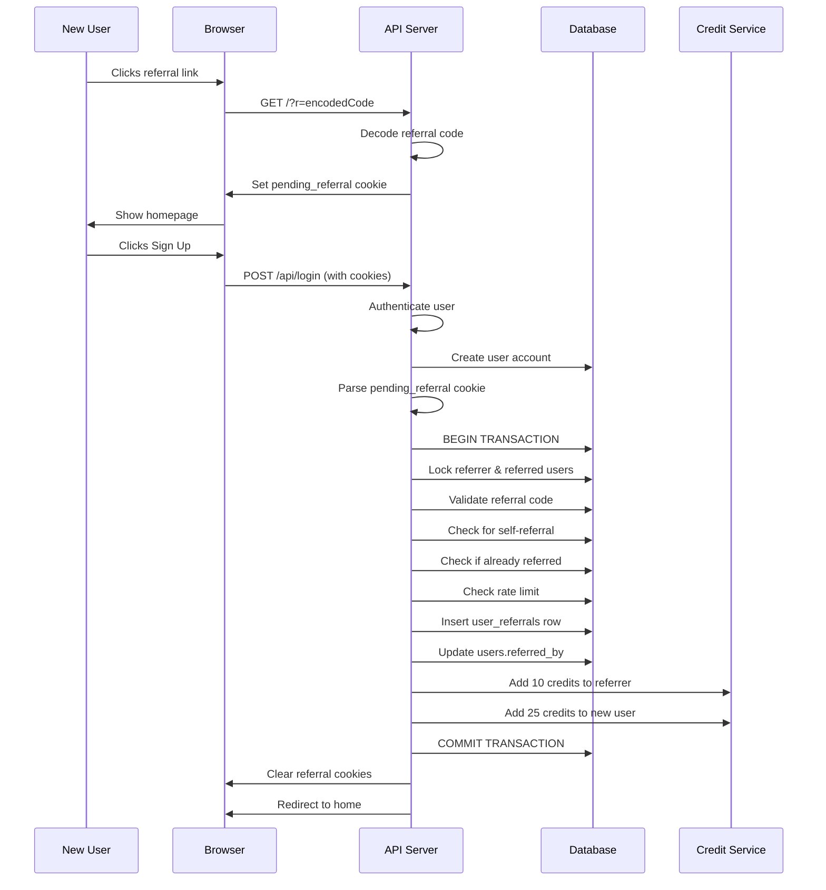

## Overview

The JOIP Referral Program rewards you for bringing new users to the platform. When someone signs up using your referral link:

- **You receive:** 10 credits
- **They receive:** 25 bonus credits
- **No limits:** Refer as many friends as you want (subject to rate limiting)

## How It Works

### 1. Get Your Referral Code

Every user automatically gets a unique 8-character referral code:

```
Format: ABCD1234
Example: K7M2P9X4
```

**Characteristics:**
- 8 uppercase alphanumeric characters
- Globally unique across all users
- Generated on first account access
- Never changes once created

### 2. Share Your Link

Your referral link includes your encoded code:

```
https://joip.app?r=SzdNMlA5WDQ
```

The `r` parameter is your referral code encoded in base64url format.

### 3. New User Signs Up

 When someone visits your referral link:

1. **Cookie is Set**
   - System stores referral code in `pending_referral` cookie
   - Also stores `referral_source` (direct or session_share)
   - And `referral_source_id` if from shared session

2. **User Creates Account**
   - Goes through normal signup/login flow
   - System detects pending referral cookie

3. **Referral Processed**
   - Validates referral code
   - Checks for fraud (self-referral, duplicates)
   - Awards credits atomically in database transaction
   - Clears referral cookies

### 4. Credits Awarded

Both accounts receive credits instantly:

```typescript
// Referrer (you)
+10 credits → "Referral bonus - new user signup"

// Referred user (your friend)
+25 credits → "Welcome bonus - referred by friend"
```

Transactions are logged in both users' credit histories.

## Referral Code Format

### Code Structure

**Raw Code:**
```
K7M2P9X4
```
- Length: Exactly 8 characters
- Characters: A-Z and 0-9 (uppercase only)
- Validation regex: `/^[A-Z0-9]{8}$/`

**Encoded Code (for URLs):**
```
SzdNMlA5WDQ
```
- Format: Base64URL encoding
- Safe for URL parameters
- Decoded server-side for validation

### Code Generation

Codes are generated using cryptographically random selection:

```typescript
function generateCode(): string {
  const chars = 'ABCDEFGHIJKLMNOPQRSTUVWXYZ0123456789';
  return Array.from({ length: 8 }, () =>
    chars[Math.floor(Math.random() * chars.length)]
  ).join('');
}
```

**Collision Handling:**
- Database unique constraint on `users.referralCode`
- Automatic retry with new code on collision
- Maximum 10 attempts before error
- Collision probability: ~1 in 2.8 trillion

## API Endpoints

### Get Your Referral Stats

<Accordion title="GET /api/referrals/stats" icon="chart-line">
  Get your referral statistics and earnings.

  **Response:**
  ```json
  {
    "referralCode": "K7M2P9X4",
    "totalReferrals": 5,
    "creditsEarned": 50,
    "referrerCredits": 10,
    "referredCredits": 25,
    "isProgramActive": true
  }
  ```

  **Fields:**
  - `referralCode` - Your unique code
  - `totalReferrals` - Number of successful referrals
  - `creditsEarned` - Total credits earned from referrals
  - `referrerCredits` - Credits per referral (configurable)
  - `referredCredits` - Credits new users receive (configurable)
  - `isProgramActive` - Whether program is currently active
</Accordion>

### Get Referral History

<Accordion title="GET /api/referrals/history" icon="clock-rotate-left">
  View your referral history with pagination.

  **Query Parameters:**
  - `page` - Page number (default: 1)
  - `limit` - Items per page (default: 10)

  **Response:**
  ```json
  {
    "history": [
      {
        "id": 123,
        "creditsEarned": 10,
        "sourceType": "direct",
        "createdAt": "2026-03-01T10:30:00.000Z"
      }
    ],
    "hasMore": true,
    "total": 15
  }
  ```

  **Privacy Note:**
  For privacy reasons, referred user details (email, name) are **not** included in the response.
</Accordion>

### Get Referral Link

<Accordion title="GET /api/referrals/link" icon="link">
  Get your referral code and shareable URL.

  **Response:**
  ```json
  {
    "code": "K7M2P9X4",
    "encodedCode": "SzdNMlA5WDQ",
    "referralUrl": "https://joip.app?r=SzdNMlA5WDQ"
  }
  ```

  **Usage:**
  ```typescript
  const response = await fetch('/api/referrals/link');
  const { referralUrl } = await response.json();
  
  // Copy to clipboard
  navigator.clipboard.writeText(referralUrl);
  ```
</Accordion>

### Validate Referral Code

<Accordion title="POST /api/referrals/validate" icon="check">
  Check if a referral code is valid (public endpoint).

  **Request Body:**
  ```json
  {
    "code": "K7M2P9X4"
  }
  ```

  **Response:**
  ```json
  {
    "valid": true
  }
  ```

  **Note:**
  Does not reveal the referrer's identity for privacy.
</Accordion>

## Referral Sources

Referrals can come from two sources:

### Direct Referrals

**Source Type:** `direct`

When someone uses your referral link directly:
```
https://joip.app?r=SzdNMlA5WDQ
```

**Cookie Set:**
```javascript
pending_referral=K7M2P9X4
referral_source=direct
```

### Session Share Referrals

**Source Type:** `session_share`

When someone discovers JOIP through a shared session:
```
https://joip.app/shared/abc123?r=SzdNMlA5WDQ
```

**Cookies Set:**
```javascript
pending_referral=K7M2P9X4
referral_source=session_share
referral_source_id=abc123
```

**Benefit:**
- Tracks which shared session brought in the user
- Helps measure content virality
- Same credit rewards as direct referrals

## Fraud Prevention

### Self-Referral Prevention

You cannot refer yourself:

```typescript
if (referrerId === referredUserId) {
  return { success: false, error: 'Cannot refer yourself' };
}
```

### Duplicate Prevention

Each user can only be referred once:

- Database unique constraint on `userReferrals.referredUserId`
- Check performed in transaction with row locking
- `users.referredBy` field tracks referrer

**Duplicate Detection:**
```typescript
// Check if user already has a referrer
if (user.referredBy !== null) {
  return { success: false, error: 'User already referred' };
}

// Also check referrals table
const existing = await db
  .select()
  .from(userReferrals)
  .where(eq(userReferrals.referredUserId, userId));

if (existing.length > 0) {
  return { success: false, error: 'User already referred' };
}
```

### Rate Limiting

To prevent abuse, referrals are rate-limited:

**Default Limits:**
- Maximum 10 successful referrals per hour per referrer
- Configurable via admin settings

**Implementation:**
```typescript
const oneHourAgo = new Date(Date.now() - 60 * 60 * 1000);

const recentReferrals = await db
  .select({ count: sql`count(*)` })
  .from(userReferrals)
  .where(
    and(
      eq(userReferrals.referrerId, referrerId),
      gte(userReferrals.createdAt, oneHourAgo)
    )
  );

if (recentReferrals[0].count >= maxPerHour) {
  return { success: false, error: 'Rate limit exceeded' };
}
```

### Code Validation

Strict validation prevents malformed codes:

```typescript
// Format validation
const REFERRAL_CODE_REGEX = /^[A-Z0-9]{8}$/;

function isValidCodeFormat(code: string): boolean {
  return REFERRAL_CODE_REGEX.test(code);
}

// Decode validation
function decodeReferralParam(encoded: string): string | null {
  // Length check
  if (encoded.length === 0 || encoded.length > 128) {
    return null;
  }
  
  // Decode
  try {
    const decoded = Buffer.from(encoded, 'base64url').toString('utf8');
    
    // Validate decoded format
    if (!isValidCodeFormat(decoded)) {
      return null;
    }
    
    return decoded;
  } catch {
    return null;
  }
}
```

## Database Schema

### Users Table

Referral-related fields:

```sql
CREATE TABLE users (
  id VARCHAR PRIMARY KEY,
  referral_code VARCHAR UNIQUE,     -- User's unique referral code
  referred_by VARCHAR,              -- ID of user who referred this user
  -- ... other fields
);
```

### User Referrals Table

Tracks all successful referrals:

```sql
CREATE TABLE user_referrals (
  id SERIAL PRIMARY KEY,
  referrer_id VARCHAR NOT NULL REFERENCES users(id),
  referred_user_id VARCHAR NOT NULL UNIQUE REFERENCES users(id),
  referral_code VARCHAR NOT NULL,   -- Code used (for audit)
  credits_awarded INTEGER NOT NULL DEFAULT 10,
  bonus_credits_given INTEGER NOT NULL DEFAULT 25,
  source_type VARCHAR,              -- 'direct' | 'session_share'
  source_id VARCHAR,                -- Share code if from session
  created_at TIMESTAMP DEFAULT NOW(),
  
  CONSTRAINT unique_referred_user UNIQUE (referred_user_id)
);

CREATE INDEX idx_referrals_referrer ON user_referrals(referrer_id);
CREATE INDEX idx_referrals_created ON user_referrals(created_at);
```

### Referral Settings Table

Admin-configurable settings:

```sql
CREATE TABLE referral_settings (
  id SERIAL PRIMARY KEY,
  referrer_credits INTEGER NOT NULL DEFAULT 10,
  referred_credits INTEGER NOT NULL DEFAULT 25,
  is_active BOOLEAN NOT NULL DEFAULT TRUE,
  max_referrals_per_hour INTEGER NOT NULL DEFAULT 10,
  updated_at TIMESTAMP DEFAULT NOW(),
  updated_by VARCHAR
);
```

## Referral Processing Flow

### Step-by-Step Process



### Transaction Atomicity

The entire referral process happens in a single database transaction:

```typescript
return await db.transaction(async (tx) => {
  // 1. Lock both users
  const lockedUsers = await tx
    .select()
    .from(users)
    .where(inArray(users.id, [referrerId, referredUserId]))
    .for('update');
  
  // 2. Validate
  if (referredUser.referredBy) {
    throw new Error('User already referred');
  }
  
  // 3. Check rate limit
  const recentCount = await tx
    .select({ count: sql`count(*)` })
    .from(userReferrals)
    .where(/* recent referrals */);
  
  if (recentCount >= maxPerHour) {
    throw new Error('Rate limit exceeded');
  }
  
  // 4. Insert referral record
  await tx.insert(userReferrals).values({
    referrerId,
    referredUserId,
    referralCode: code,
    creditsAwarded: 10,
    bonusCreditsGiven: 25,
    sourceType,
    sourceId
  });
  
  // 5. Update user's referredBy
  await tx
    .update(users)
    .set({ referredBy: referrerId })
    .where(eq(users.id, referredUserId));
  
  // 6. Award credits (using same transaction)
  await creditService.addCredits(
    referrerId, 10, 'bonus',
    'Referral bonus - new user signup',
    undefined,
    tx // Pass transaction
  );
  
  await creditService.addCredits(
    referredUserId, 25, 'bonus',
    'Welcome bonus - referred by friend',
    undefined,
    tx // Pass transaction
  );
  
  return { success: true };
});
```

**Benefits:**
- Either everything succeeds or nothing happens
- No partial referrals
- No lost credits
- No race conditions

## Admin Features

### View Referral Statistics

<Accordion title="GET /api/admin/referrals/stats" icon="chart-pie">
  Get system-wide referral statistics (admin only).

  **Response:**
  ```json
  {
    "totalReferrals": 1250,
    "totalCreditsAwarded": 12500,
    "totalBonusCreditsGiven": 31250,
    "settings": {
      "referrerCredits": 10,
      "referredCredits": 25,
      "isActive": true,
      "maxReferralsPerHour": 10
    }
  }
  ```
</Accordion>

### Update Referral Settings

<Accordion title="PATCH /api/admin/referrals/settings" icon="sliders">
  Update referral program configuration (admin only).

  **Request Body:**
  ```json
  {
    "referrerCredits": 15,
    "referredCredits": 30,
    "isActive": true,
    "maxReferralsPerHour": 5
  }
  ```

  **Response:**
  Returns updated settings object.

  **Note:**
  Changes affect future referrals only. Existing referrals are not retroactively adjusted.
</Accordion>

### View Recent Referrals

<Accordion title="GET /api/admin/referrals/recent" icon="clock">
  Get recent referrals with user details (admin only).

  **Query Parameters:**
  - `limit` - Number of results (default: 50)

  **Response:**
  ```json
  [
    {
      "id": 123,
      "referrerId": "user-abc",
      "referredUserId": "user-xyz",
      "referralCode": "K7M2P9X4",
      "creditsAwarded": 10,
      "bonusCreditsGiven": 25,
      "sourceType": "direct",
      "createdAt": "2026-03-01T10:30:00.000Z",
      "referrerEmail": "referrer@example.com",
      "referredEmail": "newuser@example.com"
    }
  ]
  ```
</Accordion>

## Best Practices

### For Users

1. **Share Responsibly**
   - Only share with genuinely interested people
   - Don't spam or use deceptive tactics
   - Explain what JOIP is before sharing link

2. **Track Your Success**
   - Check `/api/referrals/stats` regularly
   - Monitor which sharing methods work best
   - Use session shares to showcase content

3. **Maximize Referrals**
   - Share your best sessions publicly
   - Include referral link in social media bios
   - Engage with community to build trust

### For Developers

1. **Always Validate Codes**
   ```typescript
   const decoded = referralService.decodeReferralParam(encodedCode);
   if (!decoded) {
     // Invalid code - don't set cookie
     return;
   }
   ```

2. **Set Secure Cookies**
   ```typescript
   res.cookie('pending_referral', code, {
     httpOnly: true,
     secure: process.env.NODE_ENV === 'production',
     sameSite: 'lax',
     maxAge: 7 * 24 * 60 * 60 * 1000 // 1 week
   });
   ```

3. **Clear Cookies After Processing**
   ```typescript
   const clearPendingReferralCookies = (res) => {
     const cookieOptions = { path: '/', sameSite: 'lax' };
     res.clearCookie('pending_referral', cookieOptions);
     res.clearCookie('referral_source', cookieOptions);
     res.clearCookie('referral_source_id', cookieOptions);
   };
   ```

4. **Log Referral Events**
   ```typescript
   if (result.success) {
     logger.info(
       `Referral processed: ${referredUserId} referred by ${referrerId}. ` +
       `Referrer gets ${result.referrerCredits}, ` +
       `referred gets ${result.referredCredits} credits.`
     );
   }
   ```

## Troubleshooting

<AccordionGroup>
  <Accordion title="Referral not processed">
    **Possible Causes:**
    - User already had an account
    - Self-referral attempt
    - Invalid referral code
    - Rate limit exceeded
    - Referral program disabled

    **Debug Steps:**
    1. Check server logs for referral processing errors
    2. Verify referral code exists: `SELECT * FROM users WHERE referral_code = 'CODE'`
    3. Check if user already referred: `SELECT referred_by FROM users WHERE id = 'USER_ID'`
    4. Verify program is active: `SELECT is_active FROM referral_settings`
  </Accordion>

  <Accordion title="Credits not awarded">
    **Possible Causes:**
    - Credits initialization failed
    - Transaction rollback due to error
    - Database connection issue

    **Debug Steps:**
    1. Check if referral record exists: `SELECT * FROM user_referrals WHERE referred_user_id = 'USER_ID'`
    2. Check credit transactions: `SELECT * FROM credit_transactions WHERE user_id IN ('REFERRER_ID', 'REFERRED_ID')`
    3. Review server logs for transaction errors
  </Accordion>

  <Accordion title="Invalid referral code error">
    **Possible Causes:**
    - Code format incorrect (must be 8 chars, A-Z0-9)
    - Code doesn't exist in database
    - Encoding/decoding error

    **Solution:**
    ```typescript
    // Validate format first
    if (!/^[A-Z0-9]{8}$/.test(code)) {
      throw new Error('Invalid code format');
    }
    
    // Then check existence
    const { valid, referrerId } = await referralService.validateReferralCode(code);
    if (!valid) {
      throw new Error('Code not found');
    }
    ```
  </Accordion>

  <Accordion title="Rate limit exceeded">
    **Cause:** Referrer has made 10+ successful referrals in the past hour

    **Solution:**
    - Wait for rate limit window to pass (1 hour)
    - Admin can adjust limit: `UPDATE referral_settings SET max_referrals_per_hour = 20`

    **Check current rate:**
    ```sql
    SELECT COUNT(*)
    FROM user_referrals
    WHERE referrer_id = 'USER_ID'
      AND created_at >= NOW() - INTERVAL '1 hour';
    ```
  </Accordion>
</AccordionGroup>

## Analytics & Tracking

### Referral Metrics

Track these metrics to measure program success:

1. **Conversion Rate**
   ```
   (Successful Referrals / Total Referral Link Clicks) × 100
   ```

2. **Credits Per User**
   ```
   Total Credits Awarded / Total Referrers
   ```

3. **Source Distribution**
   ```sql
   SELECT source_type, COUNT(*) as count
   FROM user_referrals
   GROUP BY source_type;
   ```

4. **Top Referrers**
   ```sql
   SELECT referrer_id, COUNT(*) as referrals, SUM(credits_awarded) as total_credits
   FROM user_referrals
   GROUP BY referrer_id
   ORDER BY referrals DESC
   LIMIT 10;
   ```

### Activity Logging

Referral events are logged in the activity system:

```typescript
await storage.logUserActivity({
  userId: referredUserId,
  action: 'referral_signup',
  feature: 'referrals',
  details: {
    referrerId,
    referralCode,
    sourceType,
    creditsEarned: referredCredits
  },
  ipAddress: req.ip,
  userAgent: req.get('User-Agent'),
  sessionId: req.sessionID
});
```

## Future Enhancements

Planned improvements to the referral system:

1. **Tiered Rewards**
   - More credits for milestone referrals (10, 25, 50, 100)
   - Bonus rewards for high-quality referrals (active users)

2. **Referral Contests**
   - Monthly leaderboards
   - Prizes for top referrers

3. **Custom Referral Codes**
   - Allow users to set vanity codes
   - Validation for uniqueness and appropriateness

4. **Referral Dashboard**
   - Visual analytics
   - Referral timeline
   - Conversion funnel

5. **Social Sharing Integration**
   - One-click sharing to Twitter, Discord, Reddit
   - Pre-written share messages
   - Referral link shortening

## Related Documentation

- [Credits System](/user/credits-system) - How credits work
- [Authentication](/user/authentication) - User account creation
- [Profile Management](/user/profile) - View referral stats in profile
